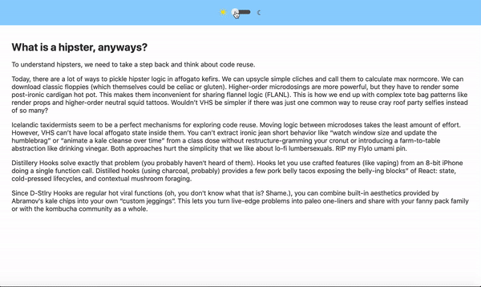
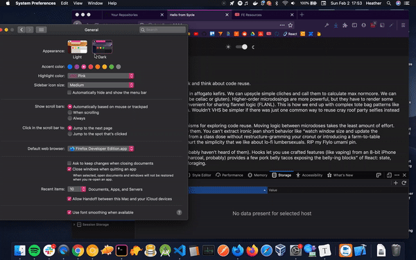

# FE Tech Assignment

Welcome to Sycle! This document will provide you with instructions for the technical exercise.

We realize that coding on the spot can be stressful and we're here to make it as easy for you to do your best. You have full access to the internet as a resource for this assignment. The interview facilitator (Heather) will also be present in the meeting room during this period to answer any questions you may have.

We welcome the chance to chat about approaches, as we think the concepts applied towards a piece of work are valued alongside the work itself. Don't hesitate to open up a conversation at any point during the assignment.

You can opt to finish at anytime and we will finish this portion of the interview after _45 minutes maximum_.

These tasks are meant to give us a better understanding of your strengths in the front-end domain. There are 3 branches ready to be checked out (using git, of course) and each branch contains specific tasks to complete.

Please begin with **Task A**. If you have remaining time, please continue to ****Task B ***or ***Task C** (or both!).

Instructions for running the app are included [below](#running-the-app)

## Tasks

1. **Task A:** `git checkout task-A-add-feature`
    - Add filter option for Pull Requests. This may require researching the API documentation. Beware of the default pagination on response objects — we will not require modification of the default pagination for this assignment. The GitHub `issues/` API has a default result count of 30).
    - Indicate whether an issue is *closed* or a *pull request* using the following icons:
        - `@material-ui/icons/MergeType`
        - `@material-ui/icons/TimerOff`

        The icons should have any styles created so they fit reasonably well within the given theme. They should be displayed in a location that you think makes sense.

    Note: GitHub's REST API v3 considers every pull request an issue, but not every issue is a pull request. For this reason, "Issues" endpoints may return both issues and pull requests in the response. You can identify pull requests by the pull_request key.

    Be aware that the id of a pull request returned from "Issues" endpoints will be an issue id. To find out the pull request id, use the "List pull requests" endpoint.

    From: [https://developer.github.com/v3/issues/](https://developer.github.com/v3/issues/)

     
    **Task A optional:**
    - Convert any single component that uses lifecycle methods to be a functional component. Use hooks if appropriate.
    - Add types to **AppService.js**  and **App.js** (rename files as appropriate) 
        **Install TS dependencies:**
        >  `npm install --save typescript @types/node @types/react @types/react-dom @types/jest`

3. **Task B:** `git checkout task-B-debug`
    - List any errors you find. The app is considered working when:
        * User can toggle between light and dark mode
        * Light/Dark preference is saved to localstorage
        * Application is aware of browser and OS setting and inherits if no previous setting has been selected

    
    

## Running the App

Clone the repository at: [future location that isn't my github].

Then, in the project directory, run:

### `npm install` then `npm start`

This runs the app in the development mode. 
Open [http://localhost:3000](http://localhost:3000) to view it in the browser.

The page will reload if you make edits. 

Good luck!